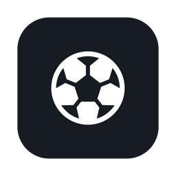
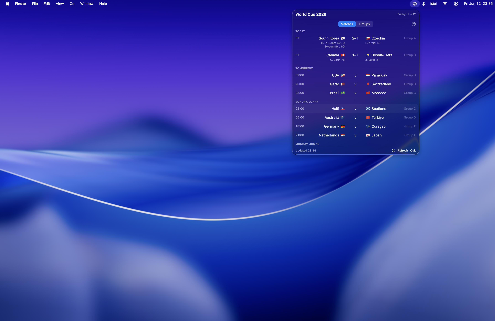

<p align="center">
  
</p>

<h1 align="center">Matchbar</h1>

<p align="center">
  
</p>

<br />

<p align="center">The World Cup in your menu bar</p>

## Features

- ⚽ Live score in your menu bar while a match is on
- 🔔 Goal notifications the moment someone scores, with scorer name and minute
- 🟢 Kickoff and full-time notifications
- 📅 Every fixture, sectioned by day, in your timezone, with results history
- 🔍 Filter matches by team or group
- 📊 Group tables ranked live, with goals, goal difference, points and last-5 form
- 🏆 Knockout qualification markers, including the best third-placed teams
- 📈 Tap any match for full team stats: shots, possession, passes, fouls, cards, corners and more

## Build

```sh
make run   # dev
make app   # bundle Matchbar.app
```
